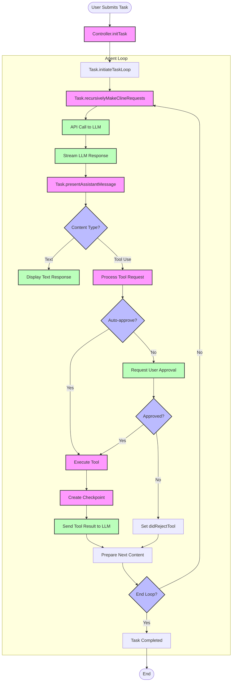
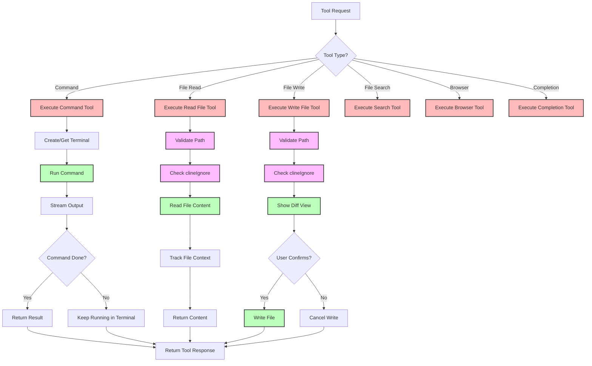
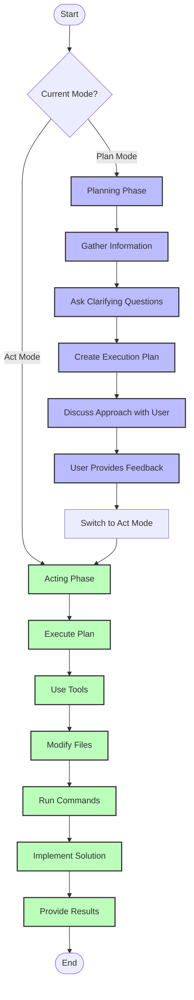

# Cline Agentic Workflow

## Agent Workflow Diagram

```mermaid
flowchart TD
    Start([User Submits Task]) --> InitTask[Controller.initTask]
    InitTask --> InitTaskLoop[Task.initiateTaskLoop]
    
    subgraph Agent_Loop[Agent Loop]
        InitTaskLoop --> RecursiveReq[Task.recursivelyMakeClineRequests]
        RecursiveReq --> ApiCall[API Call to LLM]
        ApiCall --> StreamResponse[Stream LLM Response]
        StreamResponse --> PresentAssistantMsg[Task.presentAssistantMessage]
        
        PresentAssistantMsg --> ContentCheck{Content Type?}
        ContentCheck -->|Text| ShowText[Display Text Response]
        ContentCheck -->|Tool Use| ProcessTool[Process Tool Request]
        
        ProcessTool --> AutoApproveCheck{Auto-approve?}
        AutoApproveCheck -->|Yes| ExecuteTool[Execute Tool]
        AutoApproveCheck -->|No| AskApproval[Request User Approval]
        
        AskApproval --> ApprovalCheck{Approved?}
        ApprovalCheck -->|Yes| ExecuteTool
        ApprovalCheck -->|No| SetReject[Set didRejectTool]
        
        ExecuteTool --> SaveCheckpoint[Create Checkpoint]
        SaveCheckpoint --> SendToolResult[Send Tool Result to LLM]
        SetReject --> NextContent[Prepare Next Content]
        
        SendToolResult --> NextContent
        NextContent --> EndLoopCheck{End Loop?}
        EndLoopCheck -->|No| RecursiveReq
        EndLoopCheck -->|Yes| TaskCompleted[Task Completed]
    end
    
    TaskCompleted --> End([End])
    
    classDef processNode fill:#f9f,stroke:#333,stroke-width:2px;
    classDef checkNode fill:#bbf,stroke:#333,stroke-width:2px;
    classDef activityNode fill:#bfb,stroke:#333,stroke-width:2px;
    
    class InitTask,RecursiveReq,PresentAssistantMsg,ProcessTool,ExecuteTool,SaveCheckpoint processNode;
    class ContentCheck,AutoApproveCheck,ApprovalCheck,EndLoopCheck checkNode;
    class ApiCall,StreamResponse,ShowText,AskApproval,SendToolResult activityNode;
```

## Tool Execution Flow

```mermaid
flowchart TD
    ToolRequest[Tool Request] --> ToolType{Tool Type?}
    
    ToolType -->|Command| CommandTool[Execute Command Tool]
    ToolType -->|File Read| ReadFileTool[Execute Read File Tool]
    ToolType -->|File Write| WriteFileTool[Execute Write File Tool]
    ToolType -->|File Search| SearchFileTool[Execute Search Tool]
    ToolType -->|Browser| BrowserTool[Execute Browser Tool]
    ToolType -->|Completion| CompletionTool[Execute Completion Tool]
    
    CommandTool --> Terminal[Create/Get Terminal]
    Terminal --> RunCommand[Run Command]
    RunCommand --> StreamOutput[Stream Output]
    StreamOutput --> CommandDone{Command Done?}
    CommandDone -->|Yes| ReturnResult[Return Result]
    CommandDone -->|No| KeepRunning[Keep Running in Terminal]
    
    ReadFileTool --> ValidatePath[Validate Path]
    ValidatePath --> CheckIgnore[Check clineIgnore]
    CheckIgnore --> ReadContent[Read File Content]
    ReadContent --> TrackFileContext[Track File Context]
    TrackFileContext --> ReturnContent[Return Content]
    
    WriteFileTool --> ValidateWritePath[Validate Path]
    ValidateWritePath --> CheckWriteIgnore[Check clineIgnore]
    CheckWriteIgnore --> ShowDiff[Show Diff View]
    ShowDiff --> UserConfirm{User Confirms?}
    UserConfirm -->|Yes| WriteFile[Write File]
    UserConfirm -->|No| CancelWrite[Cancel Write]
    
    ReturnResult --> ToolResponse[Return Tool Response]
    ReturnContent --> ToolResponse
    WriteFile --> ToolResponse
    CancelWrite --> ToolResponse
    KeepRunning --> ToolResponse
    
    classDef toolNode fill:#fbb,stroke:#333,stroke-width:2px;
    classDef validationNode fill:#fbf,stroke:#333,stroke-width:2px;
    classDef actionNode fill:#bfb,stroke:#333,stroke-width:2px;
    
    class CommandTool,ReadFileTool,WriteFileTool,SearchFileTool,BrowserTool,CompletionTool toolNode;
    class ValidatePath,CheckIgnore,ValidateWritePath,CheckWriteIgnore validationNode;
    class RunCommand,ReadContent,WriteFile,ShowDiff actionNode;
```

## Plan/Act Mode System

```mermaid
flowchart TD
    Start([Start]) --> ModeCheck{Current Mode?}
    
    ModeCheck -->|Plan Mode| Planning[Planning Phase]
    ModeCheck -->|Act Mode| Acting[Acting Phase]
    
    Planning --> GatherInfo[Gather Information]
    GatherInfo --> AskQuestions[Ask Clarifying Questions]
    AskQuestions --> CreatePlan[Create Execution Plan]
    CreatePlan --> DiscussApproach[Discuss Approach with User]
    DiscussApproach --> UserFeedback[User Provides Feedback]
    UserFeedback --> ModeSwitch[Switch to Act Mode]
    
    Acting --> ExecutePlan[Execute Plan]
    ExecutePlan --> UseTools[Use Tools]
    UseTools --> ModifyFiles[Modify Files]
    ModifyFiles --> RunCommands[Run Commands]
    RunCommands --> ImplementSolution[Implement Solution]
    ImplementSolution --> ProvideResults[Provide Results]
    
    ModeSwitch --> Acting
    ProvideResults --> End([End])
    
    classDef planNode fill:#bbf,stroke:#333,stroke-width:2px;
    classDef actNode fill:#bfb,stroke:#333,stroke-width:2px;
    
    class Planning,GatherInfo,AskQuestions,CreatePlan,DiscussApproach,UserFeedback planNode;
    class Acting,ExecutePlan,UseTools,ModifyFiles,RunCommands,ImplementSolution,ProvideResults actNode;
``` 